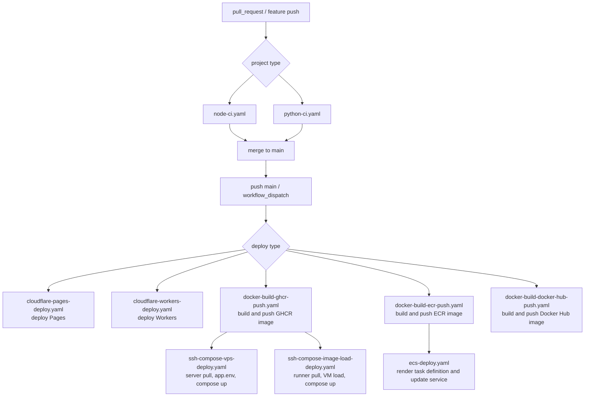
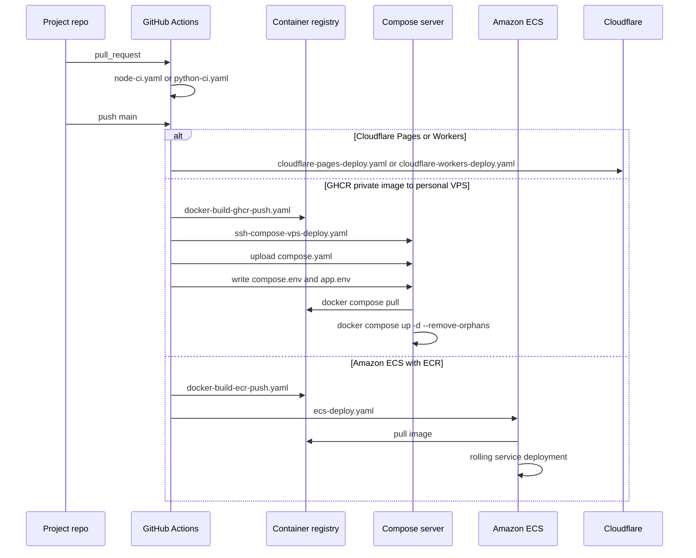

# gha

여러 프로젝트에서 공통으로 사용할 GitHub Actions reusable workflow 모음입니다.

프로젝트별 repository에서는 workflow 구현을 길게 두지 않고, 여기 있는 workflow를 `jobs.<job_id>.uses`로 호출합니다. `steps` 안에서 호출하는 방식이 아닙니다.

## Workflows

```text
gha
└── .github
    └── workflows
        ├── python-ci.yaml
        ├── node-ci.yaml
        ├── cloudflare-pages-deploy.yaml
        ├── cloudflare-workers-deploy.yaml
        ├── docker-build-ghcr-push.yaml
        ├── ssh-compose-vps-deploy.yaml
        ├── docker-build-ecr-push.yaml
        ├── docker-build-docker-hub-push.yaml
        ├── release.yaml
        ├── ecs-deploy.yaml
        └── ssh-compose-image-load-deploy.yaml
```

| Workflow | 용도 |
| --- | --- |
| `python-ci.yaml` | Python CI |
| `node-ci.yaml` | Node.js CI |
| `cloudflare-pages-deploy.yaml` | Cloudflare Pages deploy |
| `cloudflare-workers-deploy.yaml` | Cloudflare Workers deploy |
| `docker-build-ghcr-push.yaml` | GHCR Docker image build/push |
| `ssh-compose-vps-deploy.yaml` | 개인 VPS Docker Compose deploy |
| `docker-build-ecr-push.yaml` | Amazon ECR Docker image build/push |
| `docker-build-docker-hub-push.yaml` | Docker Hub image build/push |
| `release.yaml` | Release PR, tag, GitHub Release, CHANGELOG |
| `ecs-deploy.yaml` | ECS service deploy |
| `ssh-compose-image-load-deploy.yaml` | Actions runner에서 image pull 후 SSH로 Docker image, compose file, app.env를 전송하는 deploy |

## Recommended Flow

일반적으로 PR에서는 CI만 돌리고, `main` merge 이후에 배포 workflow를 실행합니다.



배포 pipeline은 target에 따라 아래처럼 갈라집니다.



## How To Use

각 프로젝트 repo의 `.github/workflows/*.yaml`에서 이 repo의 workflow를 job 단위로 호출합니다.

```yaml
jobs:
  node-ci:
    uses: wibaek/gha/.github/workflows/node-ci.yaml@v1.0
```

기본 규칙은 다음과 같습니다.

- reusable workflow는 `jobs.<job_id>.uses`로 호출합니다.
- workflow 버전은 `@v1.0`처럼 tag로 고정합니다.
- 기본 권한은 `contents: read`로 시작합니다.
- Docker image push에는 registry별 workflow를 우선 사용합니다. GHCR은 `docker-build-ghcr-push.yaml`, ECR은 `docker-build-ecr-push.yaml`, Docker Hub는 `docker-build-docker-hub-push.yaml`입니다.
- Docker image push에는 registry에 맞는 권한을 추가합니다. GHCR은 `packages: write`, ECR/ECS는 `id-token: write`가 필요합니다.
- registry별 build/push workflow는 단일 platform만 빌드하고 항상 registry에 push합니다.
- secrets는 호출하는 workflow에서 명시적으로 넘깁니다.
- `docker-build-ghcr-push.yaml`은 Docker image build/push만 담당합니다. runtime secret은 넣지 않습니다.
- 개인 VPS에 GHCR private image를 배포할 때는 `docker-build-ghcr-push.yaml` 뒤에 `ssh-compose-vps-deploy.yaml`을 붙입니다.
- runtime secret은 `ssh-compose-vps-deploy.yaml`에서 서버의 `app.env`로 작성합니다.
- GHCR private image를 registry credential 없이 단일 VM에 배포할 때는 `docker-build-ghcr-push.yaml` 뒤에 `ssh-compose-image-load-deploy.yaml`을 붙입니다.
- `ssh-compose-image-load-deploy.yaml`도 `RUNTIME_ENV`를 서버의 `app.env`로 작성하고, `compose.env`에 local `IMAGE_REFERENCE`를 기록합니다.
- `ssh-compose-image-load-deploy.yaml`은 서버에서 `docker compose up --pull never`를 강제합니다. caller repo의 compose service도 `image: ${IMAGE_REFERENCE}`와 `pull_policy: never`를 사용합니다.
- ECS 배포는 `docker-build-ecr-push.yaml` 뒤에 `ecs-deploy.yaml`을 붙입니다.
- 배포 job은 build/push workflow의 `image-reference` output을 받아서 같은 이미지를 배포합니다.
- dev, stage, prod는 같은 deploy workflow를 쓰고 `environment`, host/path/cluster/service 같은 input만 바꿉니다.
- Cloudflare Pages/Workers 배포는 Docker 라인과 별도 adapter workflow를 사용합니다.
- 릴리즈 관리는 `release.yaml`이 담당하고, Docker build/deploy는 별도 job으로 명시적으로 연결합니다.

## GHCR Docker Build

`docker-build-ghcr-push.yaml`은 Docker image build/push 전용 workflow입니다.
runtime secret, `.env`, `app.env`, `DATABASE_URL`, `JWT_SECRET`, `REDIS_URL` 같은 컨테이너 실행용 값은 이 workflow에서 다루지 않습니다.

caller workflow는 GHCR push를 위해 권한을 명시해야 합니다.

```yaml
name: Build Docker Image

on:
  push:
    branches: [main]
    tags: ["v*.*.*"]

jobs:
  docker:
    uses: wibaek/gha/.github/workflows/docker-build-ghcr-push.yaml@v1.0
    permissions:
      contents: read
      packages: write
    with:
      image-name: auto
      context: .
      dockerfile: ./Dockerfile
      platform: linux/amd64
```

`build-args`는 민감하지 않은 값만 넘깁니다.
`DATABASE_URL`, `JWT_SECRET`, `REDIS_URL` 같은 runtime secret을 `build-args`로 넘기지 않습니다.
Dockerfile에서도 `.env`나 `app.env`를 image 안으로 `COPY`하지 않습니다.

이 workflow는 단일 platform만 빌드하고, 결과 image는 항상 GHCR에 push합니다.
기본값은 `platform: linux/amd64`입니다.

권장 `.dockerignore`:

```dockerignore
.env
.env.*
!.env.example
```

repo에는 `.env.example`만 commit하고 실제 `.env` 또는 `app.env`는 commit하지 않습니다.

## Personal VPS Compose Deploy

`ssh-compose-vps-deploy.yaml`은 개인 VPS에 Docker Compose로 배포하는 workflow입니다.
GitHub Secret에 저장한 runtime env 전체를 매 배포마다 서버의 `remote-dir/app.env`로 새로 작성합니다.
서버에서 `app.env`를 직접 수정하지 않습니다.

서비스 repo의 `deploy/compose.yaml` 예시:

```yaml
services:
  app:
    image: ${IMAGE_REFERENCE:?IMAGE_REFERENCE is required}
    restart: unless-stopped
    env_file:
      - ./app.env
    ports:
      - "8000:8000"
```

Build + Deploy caller 예시:

```yaml
name: Build and Deploy

on:
  push:
    branches: [main]
  workflow_dispatch:

jobs:
  docker:
    uses: wibaek/gha/.github/workflows/docker-build-ghcr-push.yaml@v1.0
    permissions:
      contents: read
      packages: write
    with:
      image-name: auto
      context: .
      dockerfile: ./Dockerfile
      platform: linux/amd64

  deploy:
    needs: docker
    uses: wibaek/gha/.github/workflows/ssh-compose-vps-deploy.yaml@v1.0
    permissions:
      contents: read
      packages: read
    with:
      app-name: my-app
      service-name: app
      remote-dir: /srv/my-app
      compose-file: deploy/compose.yaml
      image-reference: ${{ needs.docker.outputs.image-reference }}
      ghcr-login: true
      ghcr-username: ${{ github.actor }}
    secrets:
      VPS_HOST: ${{ secrets.VPS_HOST }}
      VPS_USER: ${{ secrets.VPS_USER }}
      VPS_SSH_KEY: ${{ secrets.VPS_SSH_KEY }}
      VPS_SSH_KNOWN_HOSTS: ${{ secrets.VPS_SSH_KNOWN_HOSTS }}
      RUNTIME_ENV: ${{ secrets.PROD_APP_ENV }}
```

GitHub Secrets 운영 방식:

```text
PROD_APP_ENV:
  APP_ENV=production
  DATABASE_URL=postgresql://...
  REDIS_URL=redis://...
  JWT_SECRET=...
  SENTRY_DSN=...
```

secret을 바꾸고 싶으면 GitHub Secrets의 `PROD_APP_ENV`를 수정한 뒤 `workflow_dispatch`로 재배포합니다.
`app.env`와 `compose.env`는 서버에 남고, 매 배포마다 GitHub Secret 기준으로 덮어씁니다.
`ssh-compose-image-load-deploy.yaml`도 같은 `RUNTIME_ENV -> app.env`, `compose.env -> IMAGE_REFERENCE` 계약을 사용합니다.

`ssh-compose-vps-deploy.yaml`은 기본적으로 GHCR pull용 개인 PAT가 필요 없습니다.
같은 repository/package에 연결된 GHCR private image는 deploy job의 `GITHUB_TOKEN`으로 pull합니다.
caller deploy job에는 아래 권한을 명시합니다.

```yaml
permissions:
  contents: read
  packages: read
```

다른 repository/package의 private image를 pull해야 하면 package settings에서 workflow repository에 read access를 부여합니다.
그 방식이 어렵거나 별도 credential이 필요한 경우에만 `GHCR_TOKEN` override를 넘깁니다.
override token은 `read:packages` 권한만 가진 값을 사용합니다.
서버 docker login은 임시 `DOCKER_CONFIG`를 사용하고, 기본 `~/.docker/config.json`에는 credential을 남기지 않습니다.

이 방식은 개인 VPS 기준의 단순 운영 모델입니다.
컨테이너 env는 `docker inspect`로 볼 수 있으므로 더 강한 보안이 필요하면 Compose secrets, SSM, Secrets Manager, Vault, Kubernetes Secret 같은 전용 secret 관리로 옮깁니다.

구체적인 caller YAML 예시는 [docs/workflow-uses](docs/workflow-uses)를 봅니다.

## Versioning

공용 workflow는 SemVer tag로 배포합니다.

```bash
git tag v1.0
git push origin v1.0
```

이미 배포한 tag는 가능한 한 옮기지 않습니다. 같은 tag가 가리키는 코드가 바뀌면 사용하는 프로젝트의 재현성이 깨집니다.

## Docs

- SSH 배포 서버 준비: [docs/01_ssh_deploy_setup.md](docs/01_ssh_deploy_setup.md)
- 프로젝트별 호출 예시: [docs/workflow-uses](docs/workflow-uses)
- 참고 자료: [docs/reference](docs/reference)
